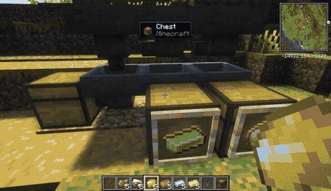
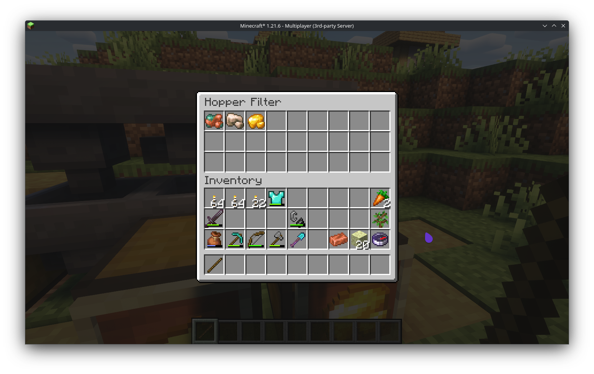

# Hopper Filter

## Info
This server-only mod allows hoppers to have a whitelist filter, in order to let pass only items that are in the list.

## Installation
The mod needs to be installed server-side only, or on the client for offline usage.

## Usage

Filter is set by using a stick on any hopper. It will open a screen where items can be added or removed. **The items will not be taken from the player's inventory**.

When the filter is empty, the hopper will act just like in vanilla Minecraft.

## Screenshots

